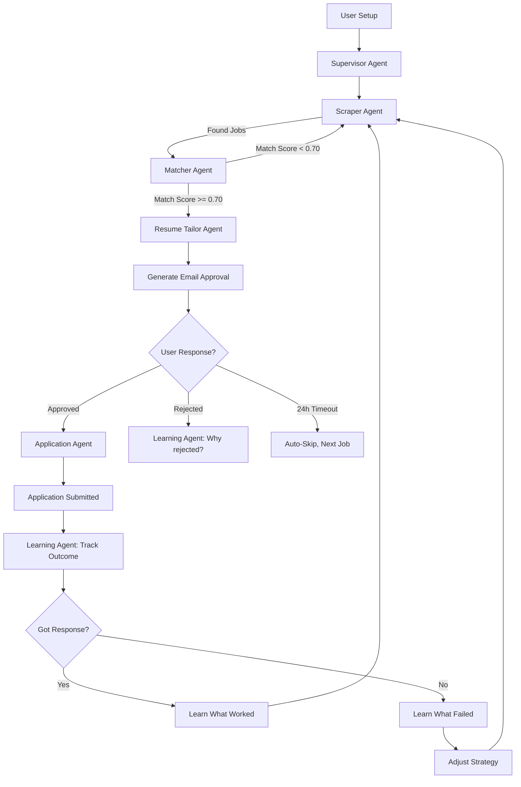

# Intelligent Agent-Based Job Automation System

## 🎯 Project Vision

A fully autonomous job application system where users simply login, provide their preferences and resume, then AI agents handle everything: job discovery, intelligent matching, resume customization, application submission with email approvals, and continuous learning from outcomes.

---

## 🏗️ System Architecture

### High-Level Flow
```
User Login (Website)
    ↓
Provide Details (Job Preferences + Resume)
    ↓
AI Agents Work Autonomously
    ↓
[Scraper Agent] → [Matcher Agent] → [Resume Tailor Agent]
    ↓
Email Approval Sent (24h timeout)
    ↓
User Approves? → [Application Agent] Submits
    ↓
[Learning Agent] Analyzes Outcome → Improves Strategy
```

### Agent Ecosystem

**🤖 Supervisor Agent** (Master Orchestrator)
- Coordinates all agents
- Manages workflow state
- Handles errors and retries
- Makes high-level decisions

**🔍 Scraper Agent** (Intelligent Job Finder)
- Uses Playwright + LLM to scrape jobs
- Adapts when websites change HTML
- Self-healing: asks LLM to find new selectors
- Extracts: title, company, location, salary, description

**🎯 Matcher Agent** (Smart Job Scorer)
- LLM-powered reasoning for job matching
- Scores jobs 0.0-1.0 with explanations
- Learns user's implicit preferences
- Adjusts criteria based on response rates

**✍️ Resume Tailor Agent** (Claude-Powered Customization)
- Analyzes job requirements deeply
- Tailors resume for each specific job
- Maintains truthfulness (no fabrication)
- A/B tests different approaches
- Learns which formats get responses

**📝 Application Agent** (Form Filler)
- Intelligently fills application forms
- Handles multi-step applications
- Manages CAPTCHAs (human-in-loop)
- Takes verification screenshots
- Stores confirmation numbers

**🧠 Learning Agent** (Continuous Improvement)
- Analyzes all outcomes (responses/rejections/interviews)
- Identifies patterns:
  - Which keywords work?
  - Which companies respond?
  - Which resume formats succeed?
- Updates strategies autonomously
- Stores insights in vector database

---

## 🔄 LangGraph Workflow



---

## 💾 Database Schema

### Existing Tables (Already Built)
- ✅ `users` - User accounts and preferences
- ✅ `jobs` - Scraped job postings
- ✅ `resumes` - Resume versions
- ✅ `applications` - Application tracking

### New Tables (To Be Added)

**approval_requests**
```sql
CREATE TABLE approval_requests (
    id UUID PRIMARY KEY,
    application_id UUID REFERENCES applications(id),
    user_id UUID REFERENCES users(id),
    job_id UUID REFERENCES jobs(id),
    resume_id UUID REFERENCES resumes(id),
    sent_at TIMESTAMP NOT NULL,
    expires_at TIMESTAMP NOT NULL,  -- 24h from sent_at
    status VARCHAR(20) DEFAULT 'pending',  -- pending/approved/rejected/expired
    approval_token VARCHAR(255) UNIQUE,  -- Magic link token
    user_response TEXT,  -- Optional feedback
    created_at TIMESTAMP DEFAULT NOW()
);
```

**agent_learning**
```sql
CREATE TABLE agent_learning (
    id UUID PRIMARY KEY,
    agent_type VARCHAR(50) NOT NULL,  -- scraper/matcher/resume/application
    metric_name VARCHAR(100) NOT NULL,
    metric_value FLOAT,
    context JSONB,  -- What was tried
    success_rate FLOAT,
    timestamp TIMESTAMP DEFAULT NOW()
);
```

**feedback_loop**
```sql
CREATE TABLE feedback_loop (
    id UUID PRIMARY KEY,
    application_id UUID REFERENCES applications(id),
    outcome VARCHAR(50),  -- response/rejection/interview/offer/no_response
    insights JSONB,  -- What agent learned
    strategy_adjustments JSONB,  -- How agent will change
    created_at TIMESTAMP DEFAULT NOW()
);
```

---

## 🌐 Frontend Architecture

### Tech Stack
- **Framework**: React 18 + TypeScript
- **Build**: Vite
- **Styling**: Tailwind CSS
- **State**: Zustand
- **Data Fetching**: TanStack Query
- **Auth**: Supabase Auth (Google + Email)
- **Real-time**: Supabase Realtime subscriptions

### Pages

**1. Login/Signup** (`/auth`)
- Google OAuth + Email/Password
- Powered by Supabase Auth

**2. Onboarding** (`/onboarding`)
- Step 1: Job Preferences
  - Job titles (Software Engineer, Python Developer, AI Engineer)
  - Locations (Bangalore, Remote, etc.)
  - Keywords (Python, AI, FastAPI, etc.)
  - Salary range (₹5L - ₹20L)
  - Work type (Remote/Hybrid/Onsite)
- Step 2: Resume Upload
  - Drag-drop resume file
  - Auto-parse experience
  - Store in Supabase Storage
- Step 3: Settings
  - Max applications/day
  - Email notifications
  - Approval preferences

**3. Dashboard** (`/dashboard`)
- Overview metrics:
  - Jobs scraped today
  - Applications pending approval
  - Active applications
  - Response rate %
- Recent agent activity feed
- Top matched jobs

**4. Jobs** (`/jobs`)
- Tabs: Pending Approval | All Jobs | Applied
- Job cards with:
  - Match score + LLM reasoning
  - Company, location, salary
  - Agent's recommendation
  - Approve/Reject buttons

**5. Applications** (`/applications`)
- Timeline view of all applications
- Status tracking (submitted → viewed → interview → offer)
- Agent's notes and insights
- Response analytics

**6. Resumes** (`/resumes`)
- Base resume
- Tailored versions for each job
- Performance metrics per resume:
  - Usage count
  - Response rate
  - Interview rate
- A/B test results

**7. Learning** (`/learning`)
- Agent insights dashboard
- What's working:
  - Best keywords
  - Successful companies
  - Optimal resume formats
- What agents changed:
  - Strategy adjustments
  - Pattern discoveries
- Success rate over time

**8. Settings** (`/settings`)
- Update job preferences
- Notification settings
- Pause/Resume agents
- API key management
- Account settings

---

## 📧 Email Approval System

### SendGrid Integration

**Approval Email Template:**
```
Subject: 🎯 New Job Match - [Job Title] at [Company]

Hi [User Name],

Our AI agent found a great match for you!

━━━━━━━━━━━━━━━━━━━━━━━━━━━━━━━━━━━━
📋 Job Details
━━━━━━━━━━━━━━━━━━━━━━━━━━━━━━━━━━━━

🏢 Company: [Company Name]
💼 Title: [Job Title]
📍 Location: [Location]
💰 Salary: [Salary Range]
🎯 Match Score: [Score]%

━━━━━━━━━━━━━━━━━━━━━━━━━━━━━━━━━━━━
🤖 Why This Job?
━━━━━━━━━━━━━━━━━━━━━━━━━━━━━━━━━━━━

[LLM-generated reasoning about why this job matches]

━━━━━━━━━━━━━━━━━━━━━━━━━━━━━━━━━━━━
✍️ Your Tailored Resume
━━━━━━━━━━━━━━━━━━━━━━━━━━━━━━━━━━━━

[Key changes made to resume]
• Added emphasis on [Skill 1]
• Highlighted [Project X] experience
• Adjusted keywords for ATS

[View Full Resume] button

━━━━━━━━━━━━━━━━━━━━━━━━━━━━━━━━━━━━
⏱️ Action Required (Expires in 24h)
━━━━━━━━━━━━━━━━━━━━━━━━━━━━━━━━━━━━

[✅ Approve & Apply]  [❌ Reject]  [⏰ Remind Me Later]

If we don't hear from you in 24 hours, we'll skip this job
and move to the next match.

━━━━━━━━━━━━━━━━━━━━━━━━━━━━━━━━━━━━

Powered by AI Job Agents 🤖
```

### Workflow

1. **Agent finds good match** (score >= 0.70)
2. **Sends email** with magic link tokens
3. **User clicks**:
   - ✅ **Approve** → Application Agent submits immediately
   - ❌ **Reject** → Agent asks why (optional feedback form)
   - ⏰ **Snooze** → Reminder in 12h
4. **No response in 24h** → Auto-skip, log as "no_decision"
5. **Learning Agent** analyzes patterns in approvals/rejections

---

## 🧠 Learning System

### What Agents Learn

**Resume Optimization**
- Which keywords increase response rates?
- Optimal resume length (1 page vs 2 pages)?
- Which skill sections get attention?
- Best bullet point formats?
- Company-specific preferences?

**Matching Strategy**
- User's implicit preferences (which jobs they approve?)
- Which job titles actually interest user?
- Salary vs culture tradeoffs?
- Company size preferences?
- Which keywords are deal-breakers?

**Application Timing**
- Best time of day to apply?
- Best day of week?
- How many applications per company?
- Follow-up strategies?

**Success Patterns**
- Which companies respond fastest?
- Which job boards yield best results?
- Which industries have higher response rates?
- Remote vs onsite success rates?

### Memory Architecture

**Vector Store (ChromaDB)**
- Stores successful resume examples as embeddings
- RAG retrieval: "Find resumes similar to this job"
- Builds knowledge base of what works

**Feedback Database**
- Every outcome stored with context
- Pattern analysis queries:
  ```sql
  -- What resume formats have best response rate?
  SELECT resume_format, AVG(got_response) as response_rate
  FROM feedback_loop
  GROUP BY resume_format
  ORDER BY response_rate DESC;
  ```

**Continuous Improvement Loop**
```python
def improve_strategy():
    # Analyze last 50 applications
    recent_outcomes = get_recent_outcomes(limit=50)

    # Find patterns
    successful_patterns = analyze_success(recent_outcomes)
    failed_patterns = analyze_failures(recent_outcomes)

    # Adjust strategy
    if successful_patterns['keyword_density'] > 0.15:
        increase_keyword_usage()

    if failed_patterns['salary_mismatch'] > 0.30:
        adjust_salary_threshold()

    # Update agent parameters
    update_matcher_weights(successful_patterns)
    update_resume_template(successful_patterns)
```

---

## 🛠️ Technical Implementation

### Phase 1: Agent Framework (Week 1-2)

**Install Dependencies:**
```bash
pip install langchain langchain-anthropic langgraph \
            langchain-community chromadb faiss-cpu
```

**Build Agents:**
1. `agents/base_agent.py` - Base agent class
2. `agents/supervisor.py` - Master orchestrator
3. `agents/scraper_agent.py` - Intelligent scraper
4. `agents/matcher_agent.py` - LLM matcher
5. `agents/resume_agent.py` - Claude tailor
6. `agents/application_agent.py` - Form filler
7. `agents/learning_agent.py` - Continuous improvement

**LangGraph State:**
```python
class JobApplicationState(TypedDict):
    user_id: str
    job_preferences: Dict
    scraped_jobs: List[Dict]
    matched_jobs: List[Dict]
    current_job: Optional[Dict]
    tailored_resume: Optional[str]
    approval_status: Optional[str]
    application_result: Optional[Dict]
    learning_insights: Dict
```

### Phase 2: Database Extensions (Week 2)

**Migrations:**
```bash
alembic revision --autogenerate -m "Add agent tables"
alembic upgrade head
```

**New Models:**
- `models/approval_request.py`
- `models/agent_learning.py`
- `models/feedback_loop.py`

### Phase 3: Email Integration (Week 3)

**SendGrid Setup:**
```python
from sendgrid import SendGridAPIClient
from sendgrid.helpers.mail import Mail

def send_approval_email(user, job, resume, approval_token):
    message = Mail(
        from_email='agents@yourapp.com',
        to_emails=user.email,
        subject=f'🎯 New Job Match - {job.title} at {job.company}',
        html_content=render_approval_template(
            user, job, resume, approval_token
        )
    )
    sg = SendGridAPIClient(settings.SENDGRID_API_KEY)
    response = sg.send(message)
    return response
```

**Approval Endpoints:**
```python
@app.get("/approve/{token}")
async def approve_application(token: str):
    # Verify token, submit application
    approval = get_approval_by_token(token)
    if approval.is_expired():
        return {"error": "Approval expired"}

    # Application Agent submits
    result = await application_agent.submit(approval)
    return {"status": "submitted", "result": result}
```

### Phase 4: Frontend (Week 3-4)

**React Structure:**
```
frontend/src/
├── components/
│   ├── auth/
│   ├── dashboard/
│   ├── jobs/
│   ├── applications/
│   └── shared/
├── pages/
│   ├── LoginPage.tsx
│   ├── OnboardingPage.tsx
│   ├── DashboardPage.tsx
│   ├── JobsPage.tsx
│   ├── ApplicationsPage.tsx
│   └── LearningPage.tsx
├── services/
│   ├── api.ts
│   ├── supabase.ts
│   └── websocket.ts
├── stores/
│   ├── authStore.ts
│   ├── jobsStore.ts
│   └── agentStore.ts
└── types/
    └── index.ts
```

**Key Features:**
- Real-time updates via Supabase subscriptions
- Optimistic UI updates
- Skeleton loading states
- Error boundaries

### Phase 5: Agent Orchestration (Week 5)

**Celery Tasks:**
```python
# Run agent workflow every hour
@celery.task
def run_agent_workflow(user_id: str):
    supervisor = SupervisorAgent(user_id)
    result = await supervisor.execute_workflow()
    return result

# Check approval expiry every hour
@celery.task
def check_approval_expiry():
    expired = get_expired_approvals()
    for approval in expired:
        approval.status = 'expired'
        learning_agent.log_no_decision(approval)
```

**Supervisor Logic:**
```python
class SupervisorAgent:
    async def execute_workflow(self):
        # 1. Scrape new jobs
        jobs = await scraper_agent.scrape()

        # 2. Match and score
        matched = await matcher_agent.evaluate(jobs)

        # 3. For each good match
        for job in matched:
            if job.score >= 0.70:
                # Tailor resume
                resume = await resume_agent.tailor(job)

                # Send approval
                await send_approval_email(job, resume)

        # 4. Learn from outcomes
        await learning_agent.analyze_recent()
```

---

## 📊 Monitoring & Analytics

### Agent Performance Metrics
- Jobs scraped per day
- Match accuracy (user approval rate)
- Resume tailoring quality (response rate)
- Application success rate
- Learning improvement rate

### User-Facing Metrics
- Total applications sent
- Response rate %
- Interview rate %
- Offer rate %
- Average time to response

### Dashboard Widgets
- Real-time agent activity feed
- Success rate trends
- Agent learning insights
- Response time analytics

---

## 🚀 Deployment

### Development
```bash
docker-compose up
```

### Production

**Backend**: Railway/Fly.io
- Auto-deploy from GitHub
- Environment variables via dashboard
- PostgreSQL + Redis included

**Frontend**: Vercel
- Auto-deploy from GitHub
- Environment variables for API URL
- CDN distribution

**Database**: Supabase
- Already set up
- Auto-backups
- Real-time enabled

**Workers**: Railway Workers
- Celery + Celery Beat
- Same codebase as API

---

## 🎯 Success Criteria

### MVP Success (Week 6)
- ✅ Agents autonomously find and apply to 20 jobs/week
- ✅ Email approvals working with 24h timeout
- ✅ 70%+ user approval rate (good matching)
- ✅ Resume tailoring shows measurable improvement
- ✅ Learning agent demonstrates strategy adjustments

### Long-term Success (3 months)
- ✅ 10%+ response rate from applications
- ✅ 5%+ interview rate
- ✅ Agents autonomously improve month-over-month
- ✅ Users spend <30 min/week managing system
- ✅ 90%+ of applications approved (high trust)

---

## 📝 Next Steps

### Immediate Actions
1. Install agent dependencies:
   ```bash
   pip install langchain langchain-anthropic langgraph chromadb
   ```

2. Get API keys:
   - Claude API: https://console.anthropic.com/
   - SendGrid: https://signup.sendgrid.com/

3. Build agent system (I'll do this once you confirm)

4. Test workflow with your job preferences

5. Deploy frontend and connect to agents

---

## 🤖 The Future

Once this is working, agents can:
- Negotiate salary ranges
- Schedule interviews automatically
- Prepare interview answers based on job
- Follow up with recruiters
- Accept/reject offers based on criteria
- Network on LinkedIn
- Build portfolio projects to fill skill gaps

**This is just the beginning of autonomous career management!** 🚀

---

**Ready to build? Let's start with the agents!**
