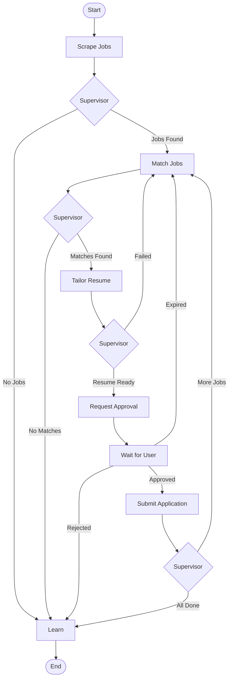

# AI Agent System

This directory contains the autonomous AI agent system for job application automation using LangGraph and Groq.

## Architecture

### Agents

1. **Supervisor Agent** (`supervisor_agent.py`)
   - Master orchestrator for the entire workflow
   - Decides which agent to invoke next
   - Handles errors and recovery
   - Monitors workflow health

2. **Scraper Agent** (`scraper_agent.py`)
   - Scrapes job postings from multiple platforms
   - Uses LLM to adapt to site changes
   - Learns which sources yield best results
   - Returns structured job data

3. **Matcher Agent** (`matcher_agent.py`)
   - Evaluates job fit using LLM reasoning
   - Calculates match scores (0.0 - 1.0)
   - Filters jobs below threshold
   - Provides detailed reasoning

4. **Resume Tailor Agent** (`resume_tailor_agent.py`)
   - Customizes resume for each job
   - Uses Groq Llama 70B for quality
   - Optimizes for ATS systems
   - Maintains authenticity (no false claims)

5. **Learning Agent** (`learning_agent.py`)
   - Analyzes application outcomes
   - Discovers success/failure patterns
   - Adjusts agent strategies
   - Improves over time

### Workflow

The workflow (`workflow.py`) is built using LangGraph and follows this flow:

```
Start → Scrape → Match → Tailor → Approve → Apply → Learn → End
          ↑        ↓        ↓         ↓        ↓       ↓
          └────────┴────────┴─────────┴────────┴───────┘
                      (Supervisor decides next step)
```

Each step:
- **Scrape**: Find job postings matching user preferences
- **Match**: Score and filter jobs using LLM
- **Tailor**: Customize resume for the job
- **Approve**: Send email to user for approval (24h timeout)
- **Apply**: Submit application (after approval)
- **Learn**: Analyze results and improve strategies

### State Management

`state.py` defines the workflow state (`JobApplicationState`) that is passed between agents:

- User context (preferences, resume)
- Workflow status (current step, errors)
- Scraping results (jobs, stats)
- Matching results (scores, reasoning)
- Resume tailoring (changes, reasoning)
- Approval status (pending/approved/rejected)
- Learning insights (patterns, adjustments)
- Agent decisions (history)

## Usage

### Basic Usage

```python
from agents import run_job_application_workflow

# User preferences
user_preferences = {
    "keywords": ["Python", "Django", "FastAPI"],
    "location": "Remote",
    "job_type": "Full-time",
    "experience_level": "Mid-level",
    "salary_min": 80000,
    "skills": ["Python", "React", "PostgreSQL"]
}

# Run workflow
final_state = await run_job_application_workflow(
    user_id="user-123",
    user_preferences=user_preferences
)

# Check results
scraped_count = len(final_state["scraped_jobs"])
matched_count = len(final_state["matched_jobs"])
print(f"Scraped {scraped_count} jobs, matched {matched_count}")
```

### Resume Workflow After Approval

```python
from agents import resume_job_application_workflow

# After user approves via email, resume workflow
state["approval_status"] = "approved"
final_state = await resume_job_application_workflow(state)
```

### Individual Agent Usage

```python
from agents import ScraperAgent, MatcherAgent, create_initial_state

# Create state
state = create_initial_state(
    user_id="user-123",
    user_preferences={"keywords": ["Python"]}
)

# Run scraper
scraper = ScraperAgent()
state = await scraper.execute(state)

# Run matcher
matcher = MatcherAgent()
state = await matcher.execute(state)
```

## Configuration

### Required Environment Variables

```bash
# Groq API for agents
GROQ_API_KEY=your_groq_api_key_here

# SendGrid for approval emails
SENDGRID_API_KEY=your_sendgrid_api_key_here
NOTIFICATION_EMAIL=noreply@yourdomain.com

# Application settings
MIN_MATCH_SCORE_THRESHOLD=0.70
MAX_APPLICATIONS_PER_DAY=20
```

### Agent Models

- **Supervisor**: `llama-3.1-8b-instant` (low temperature for consistency)
- **Scraper**: `llama-3.1-8b-instant` (fast, cost-effective)
- **Matcher**: `llama-3.1-8b-instant` (good reasoning)
- **Resume Tailor**: `llama-3.1-70b-versatile` (higher quality)
- **Learning**: `llama-3.1-70b-versatile` (complex analysis)

## Testing

Run the test script to see the complete workflow in action:

```bash
cd backend
python test_agents.py
```

This will:
- Test the complete workflow with mock data
- Show scraping, matching, and tailoring results
- Display agent decisions and learning insights
- Work without API keys (uses mock data)

## How Agents Learn

### Learning Loop

1. **Outcome Collection**: Track responses, rejections, interviews
2. **Pattern Discovery**: Analyze what works and what doesn't
3. **Strategy Adjustment**: Update matching criteria, resume tactics
4. **Feedback Integration**: Learn from user approval/rejection

### What Agents Learn

- **Scraper**: Which job boards yield best matches
- **Matcher**: Optimal threshold, keyword importance
- **Resume Tailor**: Effective keywords, formatting
- **Overall**: User preferences, success patterns

### Learning Storage

Learning insights are stored in:
- `agent_learning` table (metrics, success rates)
- `feedback_loop` table (outcomes, insights)
- `agent_memory` table (vector embeddings for RAG)

## Email Approval System

The approval system (`services/email_approval.py`) handles:

1. **Approval Request**: Email sent with job details and tailored resume
2. **Magic Links**: One-click approve/reject buttons
3. **24h Timeout**: Auto-skip if no response
4. **User Feedback**: Collect feedback on rejections for learning

Email includes:
- Job details (title, company, salary, location)
- Match score and AI reasoning
- Preview of tailored resume
- Approve/Reject buttons
- Expiration time

## Workflow Visualization



## Error Handling

- Each agent has retry logic with exponential backoff
- Errors are collected in state for analysis
- Workflow continues even if individual steps fail
- Supervisor monitors error count and can stop workflow
- Learning agent analyzes error patterns

## Performance Optimization

- Use smaller models (8B) for fast operations
- Use larger models (70B) only for quality-critical tasks
- Parallel processing where possible
- Caching for repeated operations
- Rate limiting to avoid API throttling

## Next Steps

1. Implement actual job scraping (Playwright/ScrapingBee)
2. Implement application submission logic
3. Add vector store (ChromaDB) for agent memory
4. Create Celery tasks for background processing
5. Build API endpoints for frontend integration
6. Add monitoring and analytics
7. Implement A/B testing for agent strategies
